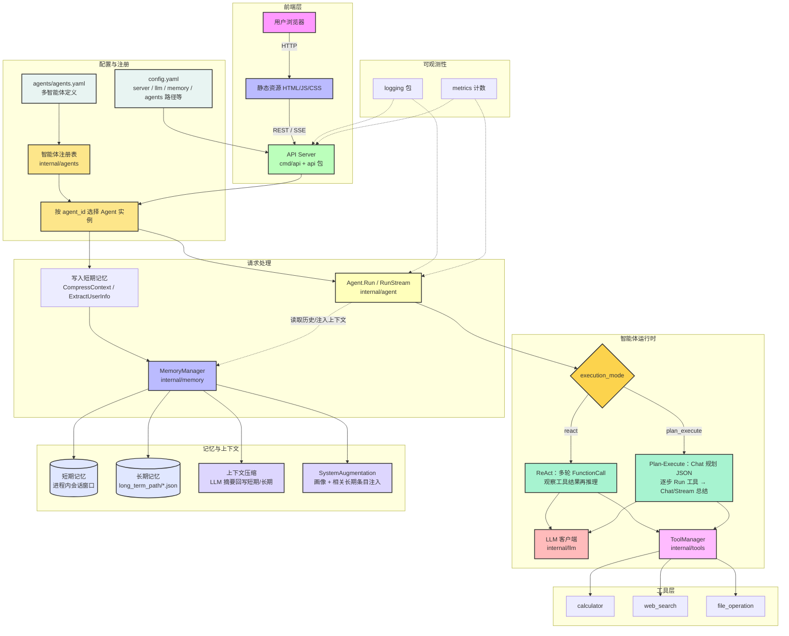

# circle-go

一个基于 Go 语言开发的前后端分离 AI-Agent 系统，支持多会话、长短期记忆、ReAct 与 Plan-Execute、可配置多智能体、函数调用和 MCP 协议。

## 功能特性

- **多会话支持**：每个会话独立维护对话与记忆
- **长短期记忆**：短期对话窗口、长期条目落盘，支持画像与相关记忆注入、可配置上下文压缩
- **ReAct 模式**：模型与工具交错调用，直至给出最终答复
- **Plan-Execute 模式**：先输出结构化执行计划，再按步调用工具，最后综合生成答复（流式接口同步展示规划与执行过程）
- **用户定义智能体**：通过 `agents/agents.yaml` 配置多个智能体（系统提示、工具子集、`execution_mode` 等），`GET /api/agents` 列出可用实例
- **函数调用**：内置计算器、网络搜索、文件等工具，可扩展注册
- **MCP 协议**：支持 Model Context Protocol 客户端配置（可按需接线业务）
- **流式响应**：SSE 流式聊天
- **监控和日志**：结构化日志与基础指标计数

## 技术栈

- **后端**：Go 语言
- **前端**：HTML5 + JavaScript
- **LLM 集成**：OpenAI API
- **容器化**：Docker

## 系统架构

### 架构图




### 架构说明

1. **前端层**：浏览器加载 `frontend/` 静态资源；通过 JSON 调用 `/api/chat`、`/api/chat/stream`，可选携带 `agent_id`；`GET /api/agents` 获取已加载智能体列表。
2. **API 服务**：`api.Server` 解析配置、初始化共享的 `MemoryManager`、`ToolManager`、LLM 客户端；按 `agents` 配置为每个智能体构造独立 `*agent.Agent`（提示词、模式、工具子集不同）。
3. **配置与注册**：`config.yaml` 指定 `agents.definitions_file` 等；YAML 中声明 `default_agent` 与各 `agents[]` 条目（`execution_mode`、`max_steps`、`tools` 等）。
4. **智能体层**：`react` 走多轮 `FunctionCall` 工具循环；`plan_execute` 先规划再执行再总结；均通过 `MemoryManager` 拉取短期历史，并可在 system 中附加画像与相关长期记忆片段。
5. **记忆层**：短期消息驻内存并受 `short_term_size` 约束；长期条目按会话写入磁盘；可选 LLM 摘要压缩；画像由对话侧写回并参与后续注入。
6. **工具层**：统一由 `ToolManager` 注册与执行，供两种执行模式复用。
7. **可观测性**：请求与 Agent 路径打结构化日志，并对关键事件做简单指标计数。

### 数据流向

1. 浏览器发起聊天请求（可选 `agent_id`、`session_id`、消息正文）。
2. API 校验并选择对应 `Agent`；必要时写入用户消息到短期记忆。
3. `CompressContext` / `ExtractUserInfo` 在阈值满足时异步优化上下文与画像（失败仅记日志，不阻断主流程）。
4. Agent 根据 `execution_mode` 进入 ReAct 或 Plan-Execute 路径，多次调用 LLM，并在需要时调用工具。
5. 工具结果回注对话消息或计划执行记录；记忆模块按需写入长期条目或摘要。
6. 最终答复写回短期记忆；流式接口通过 SSE 分块下发（Plan-Execute 时先推送规划与执行说明，再流式总结）。
7. 日志与指标贯穿 API 与 Agent 调用链，便于排查与容量感知。

## 快速开始

### 安装依赖

```bash
go mod tidy
```

### 配置文件

复制 `config/config.example.yaml` 为 `config/config.yaml` 并修改配置：

```yaml
# Server configuration
server:
  host: 0.0.0.0
  port: 8080

# LLM configuration
llm:
  api_key: "your-openai-api-key"
  model: "gpt-4"
  base_url: "https://api.openai.com/v1"
  max_tokens: 1000
  temperature: 0.7

# Memory configuration
memory:
  short_term_size: 10
  long_term_path: "./memory"

# MCP configuration
mcp:
  enabled: false
  url: "http://localhost:8000"
```

**注意**：请确保不要将包含实际API密钥的config.yaml文件提交到版本控制系统，该文件已在.gitignore中被忽略。

### 启动服务

```bash
go run cmd/api/main.go
```

服务将在 `http://localhost:8080` 启动。

## API 文档

### 1. 聊天接口

**POST /api/chat**

请求体（`agent_id` 可选，须与 `agents/agents.yaml` 中某 `id` 一致；缺省使用 `default_agent`）：

```json
{
  "session_id": "session123",
  "message": "你好，帮我计算 2 + 3 * 4",
  "agent_id": "default"
}
```

响应：

```json
{
  "response": "计算结果: 14"
}
```

### 2. 流式聊天接口

**POST /api/chat/stream**

请求体：

```json
{
  "session_id": "session123",
  "message": "你好，帮我计算 2 + 3 * 4",
  "agent_id": "planner"
}
```

响应：流式 SSE 格式

### 3. 智能体列表接口

**GET /api/agents**

响应示例：

```json
{
  "default_agent_id": "default",
  "agents": [
    {
      "id": "default",
      "name": "通用助手（ReAct）",
      "execution_mode": "react",
      "max_steps": 12,
      "human_in_the_loop": false
    }
  ]
}
```

### 4. 会话列表接口

**GET /api/sessions**

响应：

```json
{
  "sessions": ["session123", "session456"]
}
```

### 5. 会话详情接口

**GET /api/sessions/{id}**

响应：

```json
{
  "id": "session123",
  "created_at": "2024-01-01T00:00:00Z",
  "last_activity": "2024-01-01T00:00:00Z",
  "short_term": [...],
  "long_term": [...]
}
```

## 内置工具

### 1. 计算器工具 (`calculator`)

**参数**：

- `expression`: 数学表达式，例如：`2 + 3 * 4`

**示例**：

```json
{
  "name": "calculator",
  "arguments": {
    "expression": "2 + 3 * 4"
  }
}
```

### 2. 网络搜索工具 (`web_search`)

**参数**：

- `query`: 搜索查询词
- `num_results`: 返回结果数量，默认为 3

**示例**：

```json
{
  "name": "web_search",
  "arguments": {
    "query": "Go语言教程",
    "num_results": 3
  }
}
```

### 3. 文件操作工具 (`file_operation`)

**参数**：

- `operation`: 操作类型：`read` 或 `write`
- `file_path`: 文件路径
- `content`: 写入文件的内容（仅在 operation 为 write 时需要）

**示例**：

```json
{
  "name": "file_operation",
  "arguments": {
    "operation": "write",
    "file_path": "./test.txt",
    "content": "Hello, World!"
  }
}
```

## 项目结构

```
circle-go/
├── agents/             # 多智能体 YAML（definitions_file 指向此处）
├── api/                # HTTP 路由与 Server 组装
├── cmd/api/            # 进程入口
├── config/             # 配置加载与示例
├── frontend/           # 静态前端
├── internal/
│   ├── agent/          # ReAct / Plan-Execute、消息拼装
│   ├── agents/         # 智能体 YAML 加载与校验
│   ├── llm/            # LLM 接口与 OpenAI 实现
│   ├── logging/        # 日志与指标
│   ├── mcp/            # MCP 客户端
│   ├── memory/         # 短长期记忆、压缩与上下文注入
│   └── tools/          # 内置工具与 ToolManager
├── Dockerfile
├── docker-compose.yml
├── go.mod
└── go.sum
```

## 运行测试

```bash
go test ./...
```

## 容器化部署

### 构建镜像

```bash
docker build -t ai-agent .
```

### 运行容器

```bash
docker run -p 8080:8080 --env OPENAI_API_KEY=your_api_key ai-agent
```

### 使用 Docker Compose

```bash
docker-compose up -d
```

## 开发指南

### 添加自定义工具

1. 实现 `tools.Tool` 接口
2. 在 `api/server.go` 中注册工具

### 扩展 LLM 支持

1. 实现 `llm.LLM` 接口
2. 在 `api/server.go` 中初始化

### 改进记忆管理

修改 `internal/memory/memory.go` 中的记忆管理逻辑

## 贡献指南

1. Fork 项目仓库
2. 创建特性分支 (`git checkout -b feature/amazing-feature`)
3. 提交更改 (`git commit -m 'Add some amazing feature'`)
4. 推送到分支 (`git push origin feature/amazing-feature`)
5. 打开 Pull Request

## 代码规范

- 遵循 Go 语言规范
- 使用 `go fmt` 格式化代码
- 编写单元测试
- 保持代码简洁明了

## 许可证

MIT License