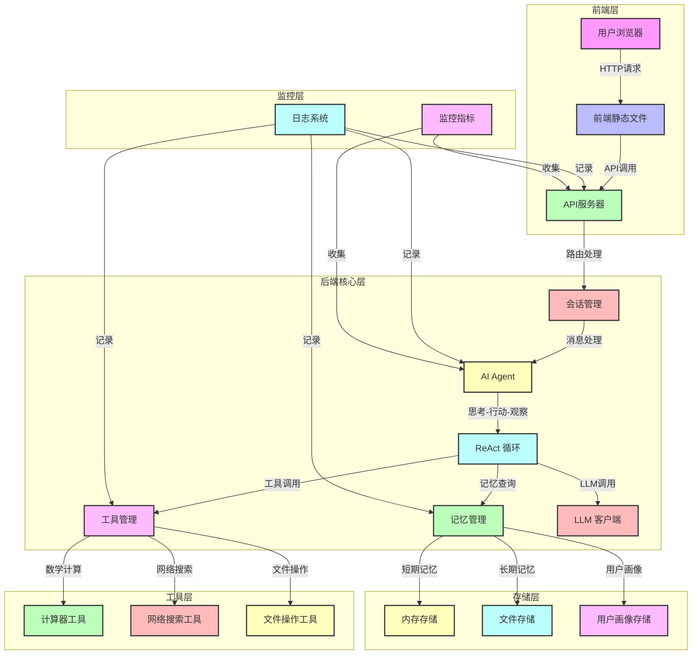

# circle-go

一个基于 Go 语言开发的前后端分离 AI-Agent 系统，支持多会话、长短期记忆、ReAct 模式、函数调用和 MCP 协议。

## 功能特性

- **多会话支持**：每个用户可以创建多个会话，会话之间相互独立
- **长短期记忆**：支持短期记忆（对话历史）和长期记忆（重要信息）
- **ReAct 模式**：采用思考-行动-观察的模式，提高任务完成能力
- **函数调用**：支持调用内置工具和自定义工具
- **MCP 协议**：支持 Model Context Protocol，与其他系统集成
- **用户认证**：支持用户注册和登录
- **流式响应**：支持实时流式聊天体验
- **监控和日志**：完善的监控和日志系统

## 技术栈

- **后端**：Go 语言
- **前端**：HTML5 + JavaScript
- **LLM 集成**：OpenAI API
- **容器化**：Docker

## 系统架构

### 架构图



### 架构说明

1. **前端层**：
   - 用户浏览器：用户与系统交互的界面
   - 前端静态文件：提供 HTML、CSS 和 JavaScript 文件
   - API 服务器：处理 HTTP 请求和响应

2. **后端核心层**：
   - 会话管理：管理用户会话和对话历史
   - AI Agent：核心智能模块，实现 ReAct 模式
   - ReAct 循环：思考-行动-观察的循环过程
   - 工具管理：管理和调用各种工具
   - 记忆管理：管理短期和长期记忆
   - LLM 客户端：与 OpenAI API 交互

3. **存储层**：
   - 内存存储：存储短期记忆（对话历史）
   - 文件存储：存储长期记忆（重要信息）
   - 用户画像存储：存储用户信息和偏好

4. **工具层**：
   - 计算器工具：执行数学计算
   - 网络搜索工具：搜索网络信息
   - 文件操作工具：读写文件操作

5. **监控层**：
   - 日志系统：记录系统运行状态和错误信息
   - 监控指标：收集系统性能和使用情况指标

### 数据流向

1. 用户通过浏览器发送请求到 API 服务器
2. API 服务器解析请求并调用相应的处理函数
3. 会话管理创建或加载用户会话
4. AI Agent 处理用户消息，执行 ReAct 循环
5. ReAct 循环根据需要调用工具、查询记忆或调用 LLM
6. 工具执行相应的操作并返回结果
7. 记忆管理更新短期和长期记忆
8. LLM 生成响应内容
9. AI Agent 整合信息并生成最终响应
10. API 服务器返回响应给用户
11. 监控层记录系统运行状态和指标

## 快速开始

### 安装依赖

```bash
go mod tidy
```

### 配置文件

复制 `config/config.example.yaml` 为 `config/config.yaml` 并修改配置：

```yaml
# Server configuration
server:
  host: 0.0.0.0
  port: 8080

# LLM configuration
llm:
  api_key: "your-openai-api-key"
  model: "gpt-4"
  base_url: "https://api.openai.com/v1"
  max_tokens: 1000
  temperature: 0.7

# Memory configuration
memory:
  short_term_size: 10
  long_term_path: "./memory"

# MCP configuration
mcp:
  enabled: false
  url: "http://localhost:8000"
```

**注意**：请确保不要将包含实际API密钥的config.yaml文件提交到版本控制系统，该文件已在.gitignore中被忽略。

### 启动服务

```bash
go run cmd/api/main.go
```

服务将在 `http://localhost:8080` 启动。

## API 文档

### 1. 聊天接口

**POST /api/chat**

请求体：
```json
{
  "session_id": "session123",
  "message": "你好，帮我计算 2 + 3 * 4"
}
```

响应：
```json
{
  "response": "计算结果: 14"
}
```

### 2. 流式聊天接口

**POST /api/chat/stream**

请求体：
```json
{
  "session_id": "session123",
  "message": "你好，帮我计算 2 + 3 * 4"
}
```

响应：流式 SSE 格式

### 3. 会话列表接口

**GET /api/sessions**

响应：
```json
{
  "sessions": ["session123", "session456"]
}
```

### 4. 会话详情接口

**GET /api/sessions/{id}**

响应：
```json
{
  "id": "session123",
  "created_at": "2024-01-01T00:00:00Z",
  "last_activity": "2024-01-01T00:00:00Z",
  "short_term": [...],
  "long_term": [...]
}
```

### 5. 用户注册接口

**POST /api/auth/register**

请求体：
```json
{
  "username": "user1",
  "password": "password123",
  "email": "user1@example.com"
}
```

响应：
```json
{
  "message": "Registration successful"
}
```

### 6. 用户登录接口

**POST /api/auth/login**

请求体：
```json
{
  "username": "user1",
  "password": "password123"
}
```

响应：
```json
{
  "token": "jwt_token_here",
  "message": "Login successful"
}
```

## 内置工具

### 1. 计算器工具 (`calculator`)

**参数**：
- `expression`: 数学表达式，例如：`2 + 3 * 4`

**示例**：
```json
{
  "name": "calculator",
  "arguments": {
    "expression": "2 + 3 * 4"
  }
}
```

### 2. 网络搜索工具 (`web_search`)

**参数**：
- `query`: 搜索查询词
- `num_results`: 返回结果数量，默认为 3

**示例**：
```json
{
  "name": "web_search",
  "arguments": {
    "query": "Go语言教程",
    "num_results": 3
  }
}
```

### 3. 文件操作工具 (`file_operation`)

**参数**：
- `operation`: 操作类型：`read` 或 `write`
- `file_path`: 文件路径
- `content`: 写入文件的内容（仅在 operation 为 write 时需要）

**示例**：
```json
{
  "name": "file_operation",
  "arguments": {
    "operation": "write",
    "file_path": "./test.txt",
    "content": "Hello, World!"
  }
}
```

## 项目结构

```
ai-agent/
├── api/              # API 服务器
├── cmd/              # 命令行入口
│   └── api/          # API 服务器入口
├── config/           # 配置管理
├── frontend/         # 前端代码
├── internal/         # 内部包
│   ├── agent/        # AI Agent 核心
│   ├── auth/         # 认证管理
│   ├── llm/          # LLM 集成
│   ├── logging/      # 日志系统
│   ├── mcp/          # MCP 客户端
│   ├── memory/       # 记忆管理
│   └── tools/        # 工具管理
├── Dockerfile        # Docker 配置
├── docker-compose.yml # Docker Compose 配置
├── go.mod            # Go 模块文件
└── go.sum            # Go 依赖校验文件
```

## 运行测试

```bash
go test ./...
```

## 容器化部署

### 构建镜像

```bash
docker build -t ai-agent .
```

### 运行容器

```bash
docker run -p 8080:8080 --env OPENAI_API_KEY=your_api_key ai-agent
```

### 使用 Docker Compose

```bash
docker-compose up -d
```

## 开发指南

### 添加自定义工具

1. 实现 `tools.Tool` 接口
2. 在 `api/server.go` 中注册工具

### 扩展 LLM 支持

1. 实现 `llm.LLM` 接口
2. 在 `api/server.go` 中初始化

### 改进记忆管理

修改 `internal/memory/memory.go` 中的记忆管理逻辑

## 贡献指南

1. Fork 项目仓库
2. 创建特性分支 (`git checkout -b feature/amazing-feature`)
3. 提交更改 (`git commit -m 'Add some amazing feature'`)
4. 推送到分支 (`git push origin feature/amazing-feature`)
5. 打开 Pull Request

## 代码规范

- 遵循 Go 语言规范
- 使用 `go fmt` 格式化代码
- 编写单元测试
- 保持代码简洁明了

## 许可证

MIT License
